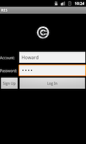

RES Documentation
===
##Title
Real Estate System: An Android application based on Odata protocal with MySQL database 

Real Estate System(RES) is the Oh!Data's project of [CS5200: Introduction to Database Systems 2013 Fall](http://www.ccs.neu.edu/home/kenb/cs5200/index.html).
##Authors
Group: Oh!Data

* [Shuyi Zhang](mailto:zhang.shuy@husky.neu.edu)
* [Yaming Huang](mailto:huang.yam@husky.ney.edu)
* [Zhaoze Zhou](mailto:zhaoze.chou@gmail.com)

from College of Computer and Information Science, Northeastern University

##Abstract
Succinct summary of the report.

It should never have citations or footnotes, and it should minimize the use of technical terminology.

##Introduction
### Background

When people, especially for some international students, come to live in a new city, the first problem they have to deal with is where to live. As fresh men to a new city, people find them hard to find an available house or apartment. Our team members suffered the same situation, so we want to help people solve this problem. 
### Project Goal

* To obtain all the available house and apartment for the users.
* To obtain valuable information about house and apartment.
* Help users make appointment to see the house.
* Allow users to post rent information.

##Requirments
[Use cases](./Document_Attachments/usecase.xml): the requirements for the software being produced.

##Design
The UML diagram of database

The UML diagram of software

##Implementation
You can get source code from our project's [Github page](https://github.com/yumminhuang/RES).

This is our project's framework. On client-side, we run an Android application as a OData consumer. OData consumers are simply applications that consume data exposed using the OData protocol. On server side, we put a MySQL database and a Java program as a OData producer. And OData producers are programs that running on server which can produce OData service and repsond to consumers.

We use Odata4J to implement both Odata producer (server-side) and Odata consumer (client-side). OData4J is a Java framework that implements the OData protocol for both consumers and producers.

### Database Implementation
User Table:

	create table User(
       id int primary key,
       name varchar(255) not null,
       phone varchar(255) not null,
       address varchar(255),
       email varchar(255),
       type enum('Landlord','Tenant','Agent'));       
Apartment Table:

	create table Apartment (
        id int primary key,
        number varchar(255) not null,
        address varchar(255),
        area int not null,
        owner int references User(id));
Topic Table:

	create table Topic(
       id int primary key,
       title varchar(255) not null,
       uid int references User(id),
       content text,
       image1 varchar(255),
       image2 varchar(255));
Reply Table:       
       
	create table Reply(
       id int primary key,
       uid int references User(id),
       tid int references Topic(id),
       content text not null,
       rtime date not null,
       image1 varchar(255),
       image2 varchar(255));
Message Table:

	create table Message(
       id int primary key,
       mfrom  int references FromUser(id),
       mto  int references ToUser(id),
       content text not null,
       mtime date not null);
Schedule Table:

	create table Schedule(
       id int primary key,
       sfrom int references FromUser(id),
       sto int references ToUser(id),
       content text not null,
       stime date not null);
FromUser Table and ToUser Table:
       
	create table FromUser(
       id int primary key references User(id));
	create table ToUser(
       id int primary key references User(id));

We also create two triggers in database:
       
	create trigger grant_access after insert on User
 	for each row begin
 	insert into FromUser set id = new.id;
 	insert into ToUser set id = new.id;
 	end
 
 	create trigger revoke_access after delete on User
 	for each row begin
 	delete from FromUser where FromUser.`id` = old.`id`;
 	delete from ToUser where ToUser.`id` = old.`id`;
 	end
 	
### Build OData Endpoint

First, we use JPA to map relation and Java objects. Then, we use methods provide by Odata4J to build OData endpoint and provide OData service.

1. Add odata4j-bundle-0.7.jar from Odata4J distribution archive to build path
2. Choose or implement an ODataProducer using the odata4j producer api. In our project, we use JPAProducer to expose an existing JPA 2.0 entity model.
 
### Android Application

To implement our Android application, we devide it into two parts. One part is Android UI framework, including . Another part is the OData comsumer, which use OData protocol to connect with server and access to database.

1. Add odata4j-clientbundle-0.7.jar from Odata4J distribution archive to build path
2. Use the odata4j consumer api to talk to an existing OData service

##Discussion
In this section, we will show our project's import functions by display following examples.

Examples of how the software is used are important. This section should establish that the requirements were met. The Discussion section is actually several sections, each showing one example in detail. Each section should have a title appropriate to the example in that section.
###1. Signup a New User

###2. Login

###3. Add a Apartment
###4. Find Apartments

###5. Schedule a Meeting

###6. Get All My Meetings
###7. Send a Message
###8. Get All My Messages

###9. Read All Topic

###10. Find Topics

##Conclusion
### Summary
Summarize the results of the project and the extent to which the goals (in the Introduction) were achieved.
### Future Work
One can also mention further work suggested by this project.

##References
1. [How to expose a MySQL database as OData](http://stackoverflow.com/questions/16990252/how-to-expose-a-mysql-database-as-odata) Stackoverflow.com Jun. 7 2013
2. [OData4j Website](https://code.google.com/p/odata4j/)
3. [OData4j API](http://odata4j.org/v/0.7/javadoc/)
4. [OData Website](http://www.odata.org/)