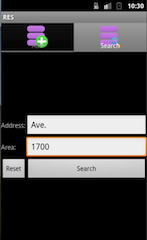

RES Documentation
===
##Title
Real Estate System: An Android application based on Odata protocol with MySQL database 

Real Estate System(RES) is the Oh!Data's project of [CS5200: Introduction to Database Systems 2013 Fall](http://www.ccs.neu.edu/home/kenb/cs5200/index.html).
##Authors
Group: Oh!Data

* [Shuyi Zhang](mailto:zhang.shuy@husky.neu.edu)
* [Yaming Huang](mailto:huang.yam@husky.ney.edu)
* [Zhaoze Zhou](mailto:zhaoze.chou@gmail.com)

from College of Computer and Information Science, Northeastern University

##Abstract
This article deals with the overall and detailed introduction of the Real State System Application on Android based on the OData Protocol, of which the idea is motivated by getting rid of hash time struggling with finding suitable place to live in. As a full-service real estate application it offers the first hand knowledge of housing information. Whether the user is a first time buyer, interested in trading, relocating, renting, the platform will provide with exceptional service such as scheduling meetings, finding related information, adding records and posting topics. The framework of the application consists of the server-side constructed by ODdata producer and the MySQL database and the client-side operated by Android application. The method implemented to solve the problem of mapping relation is to take advantage of OData4J which acts as a Java framework that implements the OData protocol for both the consumer and the producer. The article goes through all points above in several parts, including introduction, requirement, design, implementation, discussion and conclusion. 

##Introduction
### Background

When people, especially for some international students, come to live in a new city, the first problem they have to deal with is where to live. As fresh men to a new city, people find them hard to find an available house or apartment. Our team members suffered the same situation, so we want to help people solve this problem. 
### Project Goal

* To obtain all the available house and apartment for the users.
* To obtain valuable information about house and apartment.
* Help users make appointment to see the house.
* Allow users to post rent information.

##Requirements
[Use cases](./Document_Attachments/usecase.xml): the requirements for the software being produced.

##Design
The UML diagram of database

The UML diagram of software

##Implementation
You can get source code from our project's [Github page](https://github.com/yumminhuang/RES).

This is our project's framework. On client-side, we run an Android application as a OData consumer. OData consumers are simply applications that consume data exposed using the OData protocol. On server side, we put a MySQL database and a Java program as a OData producer. And OData producers are programs that running on server which can produce OData service and respond to consumers.

We use Odata4J to implement both Odata producer (server-side) and Odata consumer (client-side). OData4J is a Java framework that implements the OData protocol for both consumers and producers.

### Database Implementation
User Table
 
     create table User(
       id int primary key,
       name varchar(255) not null,
       phone varchar(255) not null,
       address varchar(255),
       email varchar(255),
       type enum('Landlord','Tenant','Agent'));
      
The `User` table is one of the most important table in our database, it stored all personal information of the user of our system. We choose id as the primary key, and force the name and phone field to be not null. Therefore, our system allows different person have the same name. The phone number could not be null so that everyone could get connected. We have three types of users : Landlord,Tenant and Agent, which is the corresponding to the real life.
 
Apartment Table:
 
      create table Apartment (
        id int primary key,
        number varchar(255) not null,
        address varchar(255),
        area int not null,
        owner int references User(id));
 
The `Apartment` table stored the entire house and apartment's information, every apartment has an id as the identifier. We force the area to be not null, because when we looking for some houses, how large the apartment or house is a big concern. We have a foreign key owner, which references from the User's id.
 
Topic Table:
 
     create table Topic(
       id int primary key,
       title varchar(255) not null,
       uid int references User(id),
       content text,
       image1 varchar(255),
       image2 varchar(255));
Our system is helping people to rent or lease houses. The `Topic` table is also important. In this table, we store all the rent or lease information. We use a id as the primary key, and force the title of the rent or lease information to be not null. It is much better to use image to show parts of the house, we allow users to put some image to the database, and store the URL address of the image. The Topic table has a foreign, uid, which can identify who post the information of the house.
 
Reply Table:      
      
     create table Reply(
       id int primary key,
       uid int references User(id),
       tid int references Topic(id),
       content text not null,
       rtime date not null,
       image1 varchar(255),
       image2 varchar(255));
`Reply` is a part the topic. After the user posting information about the house or apartment, some other users may be interested in the information, so we introduce a reply to allow user to ask or answer some question of the topic. We have id as the primary key, uid and tid are foreign keys. The uid can identify which user post this reply and tid can specify which topic the reply belongs to. In this table, we introduce the reply time. As the same from the Topic table, we encourage users to put some images to make the reply more interesting.
 
Message Table:
 
     create table Message(
       id int primary key,
       mfrom  int references FromUser(id),
       mto  int references ToUser(id),
       content text not null,
       mtime date not null);
The `Message` enables our users to communicate with each others. Each message has its own identity, id. A message must have a user who send the message, and also should have the user whom receives the message. When sending the message, we add the message time which will make the user more comfortable with our message system
 
Schedule Table:
 
     create table Schedule(
       id int primary key,
       sfrom int references FromUser(id),
       sto int references ToUser(id),
       content text not null,
       stime date not null);
 
Our system enable users make an appointment to see the house in the real world. The major function of the `Schedule` is helping to store the appointment information. A schedule should contain two users, Agent or Landlord will invite Tenant to see the house, or Tenant ask the Agent or Landlord whether can see the house or not.
 
FromUser Table and ToUser Table:
      
     create table FromUser(
       id int primary key references User(id));
     create table ToUser(
       id int primary key references User(id));
 
We also create two triggers in database:
      
      create trigger grant_access after insert on User
        for each row begin
        insert into FromUser set id = new.id;
        insert into ToUser set id = new.id;
        end
 
      create trigger revoke_access after delete on User
        for each row begin
        delete from FromUser where FromUser.`id` = old.`id`;
        delete from ToUser where ToUser.`id` = old.`id`;
        end
Whenever create a new user, the database system would help us to inser the same record into the FromUser and ToUser table 	
### Build OData Endpoint

1. We use JPA to map relation and Java objects. To do this, we use some JPA tools such as EclipseLink.
2. We use methods provide by Odata4J to build OData endpoint and provide OData service.
   1. Add `odata4j-bundle-0.7.jar` from Odata4J distribution archive to build path
   2. Choose or implement an ODataProducer using the odata4j producer api. In our project, we use `JPAProducer` to expose an existing JPA 2.0 entity model.
 
### Android Application

To implement our Android application, we divide it into two parts. One part is Android UI framework, including pictures, widgets and so on. 

Another part is utility, including a OData consumer, which use OData protocol to connect with server and access to database.

1. Add `odata4j-clientbundle-0.7.jar` from Odata4J distribution archive to build path
2. Use the odata4j consumer api to talk to an existing OData service

##Discussion
In this section, we will show our project's import functions by display following examples.

Examples of how the software is used are important. This section should establish that the requirements were met. The Discussion section is actually several sections, each showing one example in detail. Each section should have a title appropriate to the example in that section.
###1. Signup a New User
When user want to signup, he has to input his basic information, including username, email address, password and so on. After pressing "Sign Up" button, system will add this user to `User` table. If user press "Reset" button, application will remove all text, so user can input again. If user leaves some blanks, application will remind user to input enough information.

###2. Login
Users have to input username and password, then press "Login" button to login the application.

###3. Add a Apartment
Users can add apartments for himself. He has to provide apartment's information then press "Add" button. System will add this apartment to `Apartment` table.
###4. Find Apartments
User can find apartments he interested in. He can enter conditions, such as address (we support approximate query), area or both address and area, and press "Search" button. System will search all apartments in database and return a list of qualified apartments. User can press any item in list to view more information about this apartment.

###5. Schedule a Meeting
User can schedule a meeting with other users. He has to enter username who he want to meet with, meeting time and brief content then press "Add" button. System will add meeting information to `Schedule` table.

###6. Get All My Meetings
User can view all his meetings, including meetings he invite and meetings scheduled by other users. User can click any item in list to view more information about this meeting.
###7. Send a Message
User can send message to other user. He need to provide reciever's username and enter message's content. After pressing "Send" button, system will add this message into `Message` table.
###8. Get All My Messages
User can view all his messages, including messages he sends and messages he receives. User can click any item in message list to view more information about this message.

###9. Read All Topic
User can view all topics in system.If user is interested in any topic, he can click it to view more information about this topic, including the name of user who post this topic and all replies post by other users.

###10. Find Topics
User can find topics he interested in. He can enter conditions, such as topic (we support approximate query), or username who post topic, and press "Search" button. System will search all topics in database and return a list of qualified topics. User can press any item in list to view more information about this topic.
###11. Post a Topic
User can also post a new topic. He need to enter topic's title and content. After pressing "Add" button, system will save this topic in `Topic` table.

##Conclusion
### Summary
To conclude, the project provides us with great opportunity to get in-depth knowledge of what OData is and strengthened the understanding of database system and how it works. In retrospect, it takes long time from barely knowing anything about the idea of OData to the implementing the idea into real project. In the beginning, we set up our own subject we were all interested in with a draft of the goal we were going to achieve. With the project going on, problems came in continuously. Therefore we focused on how to build odata endpoint, the server side. After information gathering and discussion, we decided to use JPA to map relation and Java objects, which is provided by the ODdata4J. 
Compared with original proposal, we reconstructed the database for the sake of satisfying the prefect mapping and function realization. 

##References
1. [How to expose a MySQL database as OData](http://stackoverflow.com/questions/16990252/how-to-expose-a-mysql-database-as-odata) Stackoverflow.com Jun. 7 2013
2. [OData4j Website](https://code.google.com/p/odata4j/)
3. [OData4j API](http://odata4j.org/v/0.7/javadoc/)
4. [OData Website](http://www.odata.org/)
